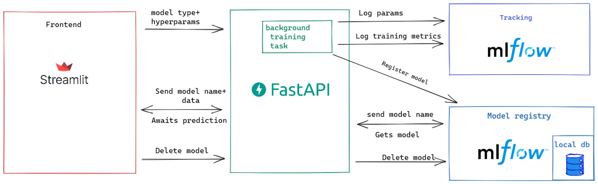

# gasAnalysis

- [gasAnalysis](#gasanalysis)
  - [1. 项目组织结构](#1-项目组织结构)
  - [2. 开发环境安装](#2-开发环境安装)
  - [3. 项目总体框架](#3-项目总体框架)
  - [4. 数据预处理](#4-数据预处理)
    - [4.1 模块功能](#41-模块功能)
    - [4.2 运行方法](#42-运行方法)
      - [4.2.1 参数说明](#421-参数说明)
      - [4.2.2 示例](#422-示例)
  - [5. 构建特征](#5-构建特征)
    - [5.1 模块功能](#51-模块功能)
    - [5.2 运行方式](#52-运行方式)
      - [5.2.1 参数说明](#521-参数说明)
      - [5.2.2 示例](#522-示例)
  - [6. 模型训练及可视化](#6-模型训练及可视化)
    - [6.1 模块功能](#61-模块功能)
    - [6.2 运行方式](#62-运行方式)
      - [6.2.1 参数说明](#621-参数说明)
      - [6.2.2 示例](#622-示例)
  - [7. 预测](#7-预测)
    - [7.1 模块功能](#71-模块功能)
      - [7.1.1 运行说明](#711-运行说明)
    - [7.2 运行方式](#72-运行方式)
      - [7.2.1 参数说明](#721-参数说明)
      - [7.2.2 示例](#722-示例)

## 1. 项目组织结构

    ├── LICENSE
    ├── Makefile           <- Makefile with commands like `make data` or `make train`
    ├── README.md          <- The top-level README for developers using this project.
    ├── data
    │   ├── external       <- Data from third party sources.
    │   ├── interim        <- Intermediate data that has been transformed.
    │   ├── processed      <- The final, canonical data sets for modeling.
    │   └── raw            <- The original, immutable data dump.
    │
    ├── docs               <- A default Sphinx project; see sphinx-doc.org for details
    │
    ├── models             <- Trained and serialized models, model predictions, or model summaries
    │
    ├── notebooks          <- Jupyter notebooks. Naming convention is a number (for ordering),
    │                         the creator's initials, and a short `-` delimited description, e.g.
    │                         `1.0-jqp-initial-data-exploration`.
    │
    ├── references         <- Data dictionaries, manuals, and all other explanatory materials.
    │
    ├── reports            <- Generated analysis as HTML, PDF, LaTeX, etc.
    │   └── figures        <- Generated graphics and figures to be used in reporting
    │
    ├── requirements.txt   <- The requirements file for reproducing the analysis environment, e.g.
    │                         generated with `pip freeze > requirements.txt`
    │
    ├── setup.py           <- makes project pip installable (pip install -e .) so src can be imported
    ├── src                <- Source code for use in this project.
    │   ├── __init__.py    <- Makes src a Python module
    │   │
    │   ├── data           <- Scripts to download or generate data
    │   │   └── make_dataset.py
    │   │
    │   ├── features       <- Scripts to turn raw data into features for modeling
    │   │   └── build_features.py
    │   │
    │   ├── models         <- Scripts to train models and then use trained models to make
    │   │   │                 predictions
    │   │   ├── predict_model.py
    │   │   └── train_model.py
    │   │
    │   └── visualization  <- Scripts to create exploratory and results oriented visualizations
    │       └── visualize.py
    │
    └── tox.ini            <- tox file with settings for running tox; see tox.readthedocs.io

## 2. 开发环境安装

本项目使用 Python 3 语言开发，推荐使用 [Anaconda](https://www.anaconda.com/) 管理 Python 环境。用户可参考 [Installation Anaconda](https://docs.anaconda.com/anaconda/install/windows/) 根据使用的操作系统下载和安装最新版本的 Anaconda。

- 创建并激活环境
  
```bash
conda create -n <YOUR_ENVIRONMENT_NAME>  python=3.8 
conda activate <YOUR_ENVIRONMENT_NAME>
```

Anaconda 的更多使用可参考 [manage-environments](https://docs.conda.io/projects/conda/en/latest/user-guide/tasks/manage-environments.html)。**注意：文档中以下示例均在该激活的环境下运行。**

- 项目依赖安装

```bash
cd <YOUR_DIR>/gasAnalyis
pip install -r requirements.txt 
```

## 3. 项目总体框架

项目总体分为四个模块，包括[数据预处理](#4-数据预处理)、[特征构建](#5-构建特征)、[模型训练及可视化](#6-模型训练及可视化)和[预测及可视化](#7-预测)。每个模块的详细内容和运行方式可以在对应章节中查看。用户可以使用自己的数据根据每个模块对应章节介绍的运行方式按照框架的顺序依次运行。**注意：每个模块都可单独运行，但前提是它依赖的前面的模块已经运行过。**


## 4. 数据预处理

### 4.1 模块功能

本模块对天然气交易数据和天气数据进行预处理。处理过程如下图所示，针对天然气交易数据，得到每分钟内交易的特征，并划分 Front month trade。针对给定的天气数据，按照气象站每天每次公布的记录提取特征，并将记录的公布时间转化为 US Central time 时间。用户可以选择要使用的数据的开始年份。


### 4.2 运行方法


```bash
ipython src/data/make_dataset.py ARCHIVE_INPUT_PATH WEATHER_NAME WEATHER_INPUT_PATH ARCHIVE_OUTPUT_PATH WEATHER_OUTPUT_PATH START_YEAR
```

#### 4.2.1 参数说明

| 参数名                  | 说明                     | 可选项                     | 格式 | 默认值                                                            |
| ----------------------- | ------------------------ | -------------------------- | ---- | ----------------------------------------------------------------- |
| **ARCHIVE_INPUT_PATH**  | Archive 存储路径         |                            |      | data/raw/Archive                                                  |
| **WEATHER_NAME**        | 使用的天气数据名         | ecmen, ecmop, gfsop, gfsen |      | ecmen                                                             |
| **WEATHER_INPUT_PATH**  | 使用的天气路径           |                            |      | data/raw/WeatherData/ECMEN_WDD_Forecasts_20100101_20210331.csv.gz |
| **ARCHIVE_OUTPUT_PATH** | Archive 预处理后保存路径 |                            |      | data/processed/Archive                                            |
| **WEATHER_OUTPUT_PATH** | 天气数据预处理后保存路径 |                            |      | data/processed/WeatherData                                        |
| **START_YEAR**          | 选择使用数据开始年份     |                            |      | 2015                                                              |

#### 4.2.2 示例

```bash
ipython  src/data/make_dataset.py data/raw/Archive ecmen data/raw/WeatherData/ECMEN_WDD_Forecasts_20100101_20210331.csv.gz data/processed/Archive data/processed/WeatherData 2015
```

如使用默认参数可直接使用

```bash
ipython  src/data/make_dataset.py
```

## 5. 构建特征

### 5.1 模块功能

本模块使用预处理后的天然气交易数据和天气数据构建模型需要的特征。每日交易时间根据气象站公布的时刻可被划分为若干个时间段(Period)，用户可以选择每日关注的交易时间段（例如：06:00 - 16:00），该时间段可能包含多个 Period（例如：2个），因此用户需要选择在该时间段内关注的Period（例如：第1个）。根据选择的Period, 每日的天然气交易数据被构建为交易片段，每个片段有气象站公布的天气特征。模块数据处理的流程如下图所示。


### 5.2 运行方式

```bash
ipython  src/features/build_features.py WEATHER_NAME WEATHER_PATH CUTOFF_PATH START_TIME END_TIME USING_PERIOD OUTPUT_DIR 
```
#### 5.2.1 参数说明

| 参数名           | 说明                           | 可选项                     | 格式  | 默认值                                                |
| ---------------- | ------------------------------ | -------------------------- | ----- | ----------------------------------------------------- |
| **WEATHER_NAME** | 使用的天气数据名               | ecmen, ecmop, gfsop, gfsen |       | ecmen                                                 |
| **WEATHER_PATH** | 预处理后的天气存储路径         |                            |       | data/processed/WeatherData/ecmen_weather_subclass.csv |
| **CUTOFF_PATH**  | 预处理后的Archive 数据存储路径 |                            |       | data/processed/Archive/cut_off_price.csv              |
| **START_TIME**   | 选取交易记录每日开始时间       |                            | HH:MM | 06:00                                                 |
| **END_TIME**     | 选取交易记录每日结束时间       |                            | HH:MM | 16:00                                                 |
| **USING_PERIOD** | 选取使用 period                |                            |       | 1                                                     |
| **OUTPUT_DIR**   | 构建的特征保存路径             |                            |       | data/processed/period                                 |

#### 5.2.2 示例

```bash
ipython src/features/build_features.py ecmen  data/processed/WeatherData/ecmen_weather_subclass.csv data/processed/Archive/cut_off_price.csv 06:00 16:00 1 data/processed/period 
```

如使用默认参数可直接使用

```bash
ipython src/features/build_features.py
```

## 6. 模型训练及可视化

### 6.1 模块功能

本模块利用已构建特征的交易片段数据集训练模型，并利用训练完成的模型对交易片段进行分类。此外，本模块提供了分类结果都可视化对比功能。


### 6.2 运行方式

```bash
ipython  src/models/kmeans/train_model.py DATA_PATH NUM_CLUSTERS SAVE_MODEL_PATH SAVE_FIGURE_PATH
```

#### 6.2.1 参数说明

| 参数名           | 说明                 | 可选项 | 格式 | 默认值                                                        |
| ---------------- | -------------------- | ------ | ---- | ------------------------------------------------------------- |
| DATA_PATH        | 已构建的特征路径     |        |      | data/processed/period/ecmen/06_00_13_40/ecmen_period_1.pkl.gz |
| NUM_CLUSTERS     | 聚类数量             |        |      | 16                                                            |
| SAVE_MODEL_PATH  | 模型保存路径         |        |      | models/k-means                                                |
| SAVE_FIGURE_PATH | 聚类可视化图保存路径 |        |      | reports/figures/kmeansCluster                                 |

#### 6.2.2 示例

```bash
ipython src/models/kmeans/train_model.py data/processed/period/ecmen/06_00_13_40/ecmen_period_1.pkl.gz 16 models/k-means reports/figures/kmeansCluster
```

如果使用默认参数可直接使用
```bash
ipython src/models/kmeans/train_model.py
```

## 7. 预测

### 7.1 模块功能

本模块利用已训练的模型和数据对新数据进行预测，用户可根据示例准备新的天气数据和基本面数据进行预测，预测结果将以可视化的方式保存至文件。


#### 7.1.1 运行说明

- 数据输入：
    a. 新天气数据：是指定气象站发布的一日天气数据；
    b. 新基本面数据：是发布的基本面一日的数据；
- 输入方式：
  - 以文件的方式传入运行，用户可参考 data\raw\newdata 目录下 newecmen.csv 和 newgnsd.csv 的示例文件内容分别建造要预测的天气数据和基本面数据；
- 输入选择：
  - 本模块也支持只使用天气或者基本面其中一种数据进行预测， 如只使用一种，将另外的数据路径设置为 None ；

**注意：对于两种数据有如下要求：**

1. 天气数据和基本面数据首行必须是列名。
2. 天气数据必须有包含以下列，列名必须保持不变且内容不能为空，其他列没有或者值为空：
   1. INIT_DATE
   2. INIT_HOUR
   3. PARAM
   4. VALUE
3. 基本面数据必须包含以下列，列名必须保持不变且内容不能为空，其他列可没有或者值为空：
   1. date

### 7.2 运行方式

```bash
ipython TRAIND_DATA_PATH MODEL_PATH NEW_WEATHER_PATH NEW_WEATHER_NAME GNSD_HISTORICAL_DATA_PATH NEW_GNSD_DATA_PATH  K  SAVE_FIGURE_PATH
```

#### 7.2.1 参数说明

| 参数名                    | 说明                   | 可选项                     | 格式 | 默认值                                                              |
| ------------------------- | ---------------------- | -------------------------- | ---- | ------------------------------------------------------------------- |
| TRAIND_DATA_PATH          | 已训练的数据路径       |                            |      | data/processed/period/ecmen/06_00_13_40/ecmen_period_1_label.pkl.gz |
| MODEL_PATH                | 已训练的模型路径       |                            |      | models/k-means/ecmen/dba/dba_16.pkl                                 |
| NEW_WEATHER_PATH          | 新的天气数据路径       |                            |      | data/raw/newdata/newecmen.csv                                       |
| NEW_WEATHER_NAME          | 新的天气数据名         | ecmen, ecmop, gfsop, gfsen |      | ecmen                                                               |
| GNSD_HISTORICAL_DATA_PATH | 基本面历史数据路径     |                            |      | data/processed/gnsdData/gnsd.csv                                    |
| NEW_GNSD_DATA_PATH        | 新的基本面数据路径     |                            |      | data/raw/newdata/newgnsd.csv                                        |
| K                         | 预测的数量             |                            | 整数 | 10                                                                  |
| SAVE_FIGURE_PATH          | 预测的可视化图保存路径 |                            |      | reports/figures/kmeansCluster/ecmen                                 |


#### 7.2.2 示例

```bash
ipython src/prediction/predict.py data/processed/period/ecmen/06_00_13_40/ecmen_period_1_label.pkl.gz models/k-means/ecmen/dba/dba_16.pkl data/raw/newdata/newecmen.csv ecmen data/processed/gnsdData/gnsd.csv data/raw/newdata/newgnsd.csv  10 reports/figures/kmeansCluster/ecmen
```

如果使用默认参数可直接使用
```bash
ipython src/prediction/predict.py
```

<!-- ## 8. 使用 app

### 8.1 体系



### 8.2 运行

进入根目录并运行

Streamlit

```bash
streamlit run app.frontend/streamlit_main.py
```

FastAPI 

```bash
uvicorn app.backend.main:app
```

MLflow UI

```bash
mlflow ui --backend-store-uri sqlite:///db/bakckend.db
``` -->